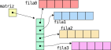

# Memoria Dinámica

Salvo en aplicaciones particulares, como sistemas de tiempo real, críticos, o muy limitados, el uso de memoria dinámica
es fundamental.
En el lenguaje de programación C, el uso de este tipo de memoria es sencillo, pero es necesario entender los conceptos
asociados a [arreglos](../arreglos) y [punteros](../punteros), a la vez que se tiene un entendimiento claro sobre la
distribución en memoria de los distintos tipos de datos.
Esto se debe a que, cuando no se hace uso de la memoria dinámica, es el compilador quien gestiona la memoria (estática)
por nosotros.
Sin embargo ¿qué es la memoria dinámica?

Tenemos que destacar que, en cuanto a memoria se refiere, físicamente la computadora posee la memoria del disco rígido,
la memoria RAM y la memoria del procesador (la memoria caché).
Al ejecutar un programa, este se carga del disco rígido y se lo ubica en la memoria RAM.
Cuando sólo se utiliza memoria estática, todas las variables que el programa necesitará están previamente definidas y
así, al iniciar una función---como es el caso de `main`---el compilador agrega las instrucciones necesarias para
reservar la memoria que la función necesita, en el stack.
Vimos que al definir un arreglo adentro de una función, como

``` c
double array[1024];
```

estamos indicando que esa función necesita 8192 bytes (8 kiB) en su stack para operar.
Sin embargo, no siempre podemos saber _a priori_ cuántos datos vamos a tener que utilizar.
Es allí cuando entra en juego la memoria dinámica.
La memoria dinámica se le pide al sistema operativo, y éste nos la otorga o no, buscando regiones de memoria libre en el
_heap_.
Una vez que esta memoria no es más utilizada, debe ser devuelta al sistema operativo, es decir, se le debe indicar que
ya no la utilizamos y puede ser otorgada a otra aplicación (o la misma si hacemos un nuevo pedido de memoria).
Estas operaciones se realizan utilizando funciones de la biblioteca estándar.

La biblioteca estándar (en `stdlib.h`) posee 4 funciones para el manejo de memoria en forma dinámica:

-   `malloc()`,
-   `free()`,
-   `realloc()`, y
-   `calloc()`.

La descripción de estas funciones no dice:


``` txt
The  malloc()  function allocates size bytes and returns a pointer to the allocated memory.  The memory
is not initialized.  If size is 0, then malloc() returns either NULL, or a unique  pointer  value  that
can later be successfully passed to free().

The free() function frees the memory space pointed to by ptr, which must have been returned by a previ‐
ous call to malloc(), calloc(), or realloc().  Otherwise, or if free(ptr) has already been  called  be‐
fore, undefined behavior occurs.  If ptr is NULL, no operation is performed.

The  calloc() function allocates memory for an array of nmemb elements of size bytes each and returns a
pointer to the allocated memory.  The memory is set to zero.  If nmemb or size is 0, then calloc()  re‐
turns  either  NULL, or a unique pointer value that can later be successfully passed to free().  If the
multiplication of nmemb and size would result in integer overflow, then calloc() returns an error.   By
contrast,  an integer overflow would not be detected in the following call to malloc(), with the result
that an incorrectly sized block of memory would be allocated:

    malloc(nmemb * size);

The realloc() function changes the size of the memory block pointed to by ptr to size bytes.  The  con‐
tents  will be unchanged in the range from the start of the region up to the minimum of the old and new
sizes.  If the new size is larger than the old size, the added memory will not be initialized.  If  ptr
is NULL, then the call is equivalent to malloc(size), for all values of size; if size is equal to zero,
and ptr is not NULL, then the call is equivalent  to  free(ptr)  (this  behavior  is  nonportable;  see
NOTES).   Unless  ptr  is NULL, it must have been returned by an earlier call to malloc(), calloc(), or
realloc().  If the area pointed to was moved, a free(ptr) is done.
```

## ¿Cómo reservar memoria dinámica?

La función `malloc`, cuyo prototipo es

``` c
void *malloc(size_t size);
```

es una función que nos permite pedir un bloque de memoria de tamaño `size`.
Por ejemplo, si quisiéramos memoria para un entero, ejecutaríamos `#!c malloc(sizeof(int))`, mientras que si quisiéramos
un bloque para un `#!c double` llamaríamos a `malloc` del siguiente modo: `#!c malloc(sizeof(double))`.
Por otro lado, si quisiéramos un arreglo de 10 `#!c float`s la invocación sería `#!c malloc(10 * sizeof(float))`,
mientras que si fuese para un arreglo de 10 punteros a `#!c float` haríamos `#!c malloc(10 * sizeof(float *))`.

A través de `malloc` le solicitamos al sistema operativo una región de un determinado tamaño y éste nos devuelve la
dirección de memoria donde dicho bloque comienza, o `#!c NULL` en caso de no poder otorgar un bloque del tamaño
solicitado.
Al recibir `#!c NULL` en caso de errores, es fácil validar si el sistema operativo nos asignó el bloque de memoria o no,
siguiendo un esquema como el siguiente:

``` c linenums="1" title="uso de malloc()"
T *array;
...
array = (T *) malloc(nmemb * sizeof(T));
if (NULL == array) {
    /* fail */
}
```

donde `nmemb` es la cantidad de elementos que queremos en el arreglo y `T` puede ser cualquier tipo: `double`, `int`,
`long unsigned`, `float *`, `char *`, etc.
Podemos ver que siempre se cumple que si `array` es de tipo `T *`, entonces el resultado de `malloc` se castea a ese
mismo tipo y como argumento de `malloc` se utiliza un nivel de punteros menos para el `sizeof()`: `sizeof(T)`.
Sin embargo, a partir del estándar ISO C99, `malloc()` retorna `void *`, por lo que no es necesario el casteo, es
redundante.


!!! example "Ejemplo: arreglo de mediciones"

    Consideremos una aplicación en la que utilizamos un sensor laser, pero admitimos diferentes modelos.
    Una forma de admitirlos es a través de una configuración que nos dice, tal vez haciendo alguna cuenta, cuántas
    muestras por segundo nos da dicho sensor.
    Sin embargo, diferentes modelos pueden dar una cantidad de muestras distintas: un modelo puede entregar 1200
    muestras mientras que otro nos puede dar 7200 muestras.
    En vez tener un arreglo estático de 7200 valores, podríamos crear uno dinámicamente al iniciar la aplicación.

    Es decir, estamos ante un caso en el que en tiempo de compilación no sabemos cuántos elementos son, pero en tiempo
    de ejecución sí.

    Si bien no es la forma más práctica, supongamos que al comienzo del programa le solicitamos al usuario que nos
    indique cuántas muestras son, luego crearemos el arreglo.
    Este proceso se ejemplifica en el siguiente código:

    ``` c linenums="1" hl_lines="17"
    #include <stdlib.h>
    ...
    char input[256];
    size_t nmemb;
    double *samples = NULL;
    ...

    if (NULL == fgets(input, 256, stdin)) {
        /* error */
    }

    nmemb = strtoul(input, &pend, 10);
    if ('\0' != *pend ...
        /* error */
    }

    samples = (double *) malloc(nmemb * sizeof(double));
    if (NULL == samples) {
        /* error */
    }
    ```

Como especifica la función, `malloc` no inicializa la memoria devuelta, es decir, se nos asigna un bloque de memoria, y
se nos devuelve un puntero al inicio el mismo tal y como se encontraba cuando se nos asignó.

Sin embargo, existe una función que nos permite inicializar el bloque de memoria con ceros.
La función en cuestión es

``` c 
void *calloc(size_t nmemb, size_t size);
```

Podemos ver que, a diferencia de `malloc`, `calloc` recibe 2 argumentos, indicando la cantidad de elementos pedidos y el
tamaño de cada elemento.
Esto nos sirve para borrar cualquier tipo de información que pudiera haber en el bloque de memoria asignado, y para
inicializar variables que tengan sentido que comiencen en cero (arreglos de números que deben inicializarse a cero,
arreglos de punteros inicializados a `#!c NULL`, estructuras, etc.).

### Ejemplos

El primer ejemplo que veremos es la creación de un vector de N enteros, y lo haremos de 2 maneras, devolviendo el
puntero por el nombre de la función, y por la interfaz.

#### Devolución por el nombre

En el primer caso, la función no es más que un llamado a `malloc`:

``` c linenums="1"
int *iarray_create(size_t n)
{
    int *iarray;

    iarray = (int *) malloc(n * sizeof(int));
    if (NULL == iarray) {
        return NULL;
    }
    return iarray;
}
```

Esta versión de la función es un poco verbosa, y una primera reducción que podríamos hacer es unificar la llamada a
`malloc` y el `if`, del siguiente modo:

``` c linenums="1"
int *iarray_create(size_t n)
{
    int *iarray;

    if (NULL == (iarray = (int *) malloc(n * sizeof(int)))) {
        return NULL;
    }
    return iarray;
}
```

Nuevamente, podemos reducir este código un poco más utilizando el operador ternario:

``` c linenums="1"
int *iarray_create(size_t n)
{
    int *iarray;

    return (NULL == (iarray = (int *) malloc(n * sizeof(int)))) ? NULL : iarray;
}
```

Y tal alguien ya se haya dado cuenta que eso que hemos hecho es retornar, en ambos casos, el resultado de la invocación
a `malloc`.
Si el resultado fue satisfactorio, retornamos `iarray`, de lo contrario, retornamos `#!c NULL`.
No obstante, `iarray` en ese último caso almacena `#!c NULL`, por lo que también estamos retornando `iarray`.
Por lo tanto podemos implementar la función del siguiente modo:

``` c linenums="1"
int *iarray_create(size_t n)
{
    return malloc(n * sizeof(int));
}
```

En todos los casos, la función se invoca del siguiente modo:

``` c linenums="1"
int *iarray = NULL;
...
iarray = iarray_create(10);
```

#### Devolución por la interfaz

En este caso, necesitamos de un parámetro auxiliar para retornar el arreglo utilizando dicho parámetro.
Veamos primero el prototipo:

``` c
status_t iarray_create(int **, size_t);
```

En este caso, `status_t` es un tipo definido por nosotros para indicar el resultado de la operación, mientras que el
primer argumento es un puntero al puntero a entero que queremos modificar, es decir, la función se invoca del siguiente
modo:

``` c linenums="1"
int *iarray = NULL;
status_t st = ST_FAIL;
...
st = iarray_create(&iarray, 10);
```

y su implementación es la siguiente:

``` c linenums="1"
status_t iarray_create(int **piarray, size_t n)
{
    if (NULL == piarray) {
        return ST_ERR_NULL_PTR;
    }
    return (NULL == (*piarray = (int *) malloc(n * sizeof(int)))) ? ST_ERR_NO_MEM : ST_OK;
}
```

#### Asignación y modificación de la memoria

El siguiente ejemplo es la copia en memoria dinámica de una cadena de caracteres, función que suele llamarse `strdup` (e
incluso es parte de estándar POSIX).
La forma más inmediata de implementar dicha función es:

``` c linenums="1"
char *strdup(const char *s)
{
    char *copy = malloc(strlen(s) + 1);
    
    if (NULL == copy) {
        return NULL;
    }
    return strcpy(copy, s);
}
```

## Devolución de la memoria pedida

Una vez que terminamos de utilizar el bloque de memoria pedido, es necesario devolverlo al sistema operativo.
A este proceso también lo llamamos _liberar_ la memoria pedida.
Para realizar dicha tarea tenemos a la función `free()`, cuyo prototipo es

``` c
void free(void *ptr);
```

Esta función recibe un puntero que nos haya devuelto `malloc()`, `realloc()` o `calloc()` y le indica al sistema
operativo que ya no lo utilizaremos.
De este modo, el sistema operativo sabe que puede reutilizar esa región de memoria.
Si las aplicaciones no liberasen la memoria que piden cuando terminan de utilizarla, el sistema operativo en seguida se
quedaría sin memoria para otorgarle al resto de las aplicaciones.

!!! example "Ejemplo: arreglo de mediciones"

    Volvamos sobre el ejemplo anterior, donde le solicitamos al sistema operativo una región de memoria de `nmemb` `#!c
    double`s para almacenar las mediciones de un sensor laser.
    Una vez que terminamos de hacer y procesar la medición, puede que ese arreglo no lo necesitemos más, en cuyo caso
    debemos liberarlo (esto es, no vamos a reutilizarlo).
    Retomando el código del ejemplo, haríamos lo siguiente

    ``` c linenums="17" hl_lines="8"
    samples = (double *) malloc(nmemb * sizeof(double));
    if (NULL == samples) {
        /* error */
    }

    ...

    free(samples);
    samples = NULL;
    ```

Es importante notar que el puntero debe ser uno que haya devuelto una de las funciones antes mencionadas, sino lo más
probable es que se intente liberar memoria estática, en cuyo caso se verá un error como el siguiente (por ejemplo, al
liberar el arreglo `input` del ejemplo anterior):

``` console title="Error al liberar memoria estática"
$ ./invalid_free
free(): invalid size
Aborted (core dumped)
$ ./invalid_free
munmap_chunk(): invalid pointer
Aborted (core dumped)
$ ./invalid_free
Segmentation fault (core dumped)
```

Y, por otro lado, la memoria pedida sólo puede ser devuelta una vez, sino veremos errores como el siguiente:

``` console title="Double free"
$ ./double_free
free(): double free detected in tcache 2
Aborted (core dumped)
```

Aunque pueden volverse más extensas las descripciones.
Es por ello que es una buena práctica asignar `#!c NULL` a un puntero una vez que se libera la memoria a la que apunta.

### Fugas de memoria

Siempre que solicitamos regiones de memoria utilizando las funciones aquí vistas, debemos devolverla al sistema
operativo.
Esto es porque todos los programas están en constante uso de memoria y para distintas operaciones necesitan memoria
dinámica (por ejemplo, la apertura de un archivo para su lectura o escritura requiere memoria dinámica).

Lamentablemente, no son poco frecuentes las fugas de memoria (o _memory leaks_) en los programas.
Esto es el uso de punteros a regiones de memoria dinámica que nunca son devueltos al sistema.
Puede haber múltiples motivos para ello, por ejemplo, que el desarrollador espera al final del programa para liberar la
memoria solicitada (lo que es un error salvo que dicha memoria se encuentre en uso hasta ese momento), o también porque
se pierde la referencia a dichas regiones.
El siguiente ejemplo, muestra en forma grosera una fuga de memoria

``` c linenums="1" hl_lines="11"
int *v = {1, 2, 3};
int *dv = malloc(3 * sizeof(int));

/* print al revés */
for (size_t i = 0; i < 3; ++i) {
    dv[i] = v[3 - i];
}
printf("{ %g, %g, %g }\n", dv[0], dv[1], dv[2]);

/* print al derecho */
dv = v;
printf("{ %g, %g, %g }\n", dv[0], dv[1], dv[2]);
```

Es grosero ya que en la linea 11 (resaltada), estamos asignado `v` a `dv`, reemplazando el valor que tenía antes, la
dirección a la región de memoria dada por `malloc`.
Una vez hecho eso, ya no sabemos a qué dirección apuntaba, y no podemos ejecutar `free(dv)`.

Pero también tenemos ejemplos más sutiles, como el siguiente:

``` c linenums="1"
char *input = NULL;

do {
    input = (char *) malloc(256);
    if (NULL == input) {
        return EXIT_FAILURE;
    }
    puts("Ingrese 'salir' para salir");
    if (NULL == fgets(input, 256, stdin)) {
        return EXIT_FAILURE;
    }
    printf("Ingresaste '%s'\n", input);
} while(strcmp("salir", s));

free(input);
```

Aquí, en la línea 4 (resaltada) estamos asignando a `input` una nueva región de memoria sin haber liberado la anterior,
y al hacerlo perdemos la referencia a la memoria que teníamos asignada.

## Cuando los tamaños son desconocidos

Supongamos que queremos leer, de `#!c stdin` **todo** lo que ingrese el usuario hasta el `'\n'`.
No hay arreglo que nos alcance para asegurarnos que podremos hacerlo, por lo que debemos recurrir a la memoria dinámica.
La función clave, en este caso, es

``` c
void *realloc(void *ptr, size_t size);
```

La función recibe un puntero que debe haber sido devuelto por `malloc`, `calloc` o `realloc` y un tamaño.
Que el puntero haya sido devuelto por una de las funciones anteriores implica que apunta a una dirección válida en el
_heap_, por lo que puede ser liberada (y el SO sabe cuánto espacio tenemos reservado en esa dirección).

Supongamos entonces que hemos pedido memoria con `malloc` del siguiente modo

``` c linenums="11"
data = (double *) malloc(3 * sizeof(double));
```

y ahora nos encontramos en la situación en que ya hemos utilizado los 3 doubles de ese arreglo pero queremos agregar
más.
Para ello, debemos solicitarle al sistema operativo que nos de más memoria, pero como queremos utilizar un arreglo, esa
memoria debe ser contigua con los otros datos.
`realloc` se encarga de esa tarea.

Por ejemplo, si para los 3 doubles que pedimos antes nos fue asignado un bloque de memoria con el tamaño justo (24
bytes) y ahora necesitamos agregar un double más, éste, claramente, no puede ser ubicado a continuación del bloque
previamente asignado (porque no hay espacio).
Si este último tuviera a continuación memoria no asignada a otro proceso, sí podríamos recibir de `realloc` la misma
memoria con ese bloque extendido, pero ello no es ninguna garantía de que suceda, por lo que no es algo que se deba
suponer **nunca**.

Como antes ya le habíamos pedido 24 bytes al sistema operativo y ahora necesitamos 1 double más, debemos solicitarle al
sistema 32 bytes, no hay una función para pedir un espacio extra, sino que se debe solicitar el total.
Al recibir el tamaño `size`, `realloc` busca una sección de memoria que tenga dicho tamaño (que puede iniciar en la
misma posición que el puntero dado o puede ser distinta).
Entonces, si antes habíamos iniciado `data` utilizando `#!c data = malloc(3 * sizeof(double));`, ahora ejecutaremos

``` c linenums="32"
aux = (double *) realloc(data, 4 * sizeof(double));
```

Es importante recordar que cada pedido de memoria que hacemos al sistema operativo puede fallar, y todas las funciones
vistas retornan `#!c NULL` en ese caso.
En el caso de `realloc`, si el pedido de memoria es exitoso, la función solicita el espacio de memoria que necesitamos,
copia los datos que había en la memoria original a la nueva posición y nos devuelve un puntero válido a una dirección de
memoria del tamaño solicitado.
En caso de fallar, retorna `#!c NULL` y no hace nada con la memoria que hemos pasado, es decir, **no** la libera.
Es por esto que en la línea de código anterior estamos utilizando una variable auxiliar para verificar el retorno de
`realloc`.
Si este nos devuelve un puntero válido, distinto de `#!c NULL`, entonces podemos reasignarlo a `data`.
Si hubiésemos utilizado `data` tanto en la llamada como a la izquierda del igual, `data` almacenaría `#!c NULL` y la
memoria que teníamos asignada no tendríamos forma de recuperarla.

En código, esta validación posllamada a `realloc` se ve de la siguiente manera:

``` c linenums="32"
aux = (double *) realloc(data, 4 * sizeof(double));
if (NULL == aux) {
    /* falló el pedido de memoria */
    free(data);
    fprintf(stderr, "Falló realloc\n");
    return EXIT_FAILURE;
}
/* no falló el pedido de memoria */
data = aux;
...
```

??? example "Versión completa del código descripto"

    A continuación pueden ver una versión completa del código desarrollado en esta sección:

    ``` c linenums="1"
    --8<-- "memdin/3_4_array.c"
    ```


## Arreglo dinámicos de arreglos dinámicos

Si queremos crear un arreglo dinámico de arreglos dinámicos, es decir, un puntero doble, debemos seguir las mismas
reglas antes vistas:

-   Siempre validar `malloc`, `calloc` o `realloc`.
-   Siempre que llamemos a `realloc`, usar un puntero distinto para la llamada y para la asignación.
-   Verificar que si a la izquierda de la asignación tenemos un nivel N de punteros, el casteo a la derecha es del mismo
    nivel N y en la llamada seguramente utilizemos un `sizeof(T)` donde `T` es un nivel de punteros menos, es decir,
    N-1.

### Matriz dinámica

El primer ejemplo que podemos considerar es la creación de una matriz dinámica.
Para ello, debemos crear un vector dinámico de arreglos de doubles (un vector dinámico de punteros a double), como se
muestra en la siguiente figura:

<figure markdown>

<caption>**Fig. 1:** Matriz formada como puntero doble.</caption>
</figure>

Un vector de punteros es un doble puntero, por lo que esa parte se lleva a cabo mediante

``` c
double **matriz = NULL;
...
matriz = (double **) calloc(n, sizeof(double *));
```

Con esas lineas creamos la cajita de la matriz y las cajitas de los punteros (el arreglo que figura en vertical).
Nos falta crear cada una de las `n` filas, pero esto ya lo haremos pensando en una función:

``` c linenums="1" title="dmatrix_create: función que crea una matriz de doubles dinámicamente.. casi"
double **dmatrix_create(size_t rows, size_t colums)
{
    double **matrix = NULL;

    matrix = (double **) calloc(rows, sizeof(double *));
    if (NULL == matrix) {
        return NULL;
    }

    for (size_t i = 0; i < rows; ++i) {
        matrix[i] = malloc(columns * sizeof(double);
        if (NULL == matrix[i]) {
            ?????
```

¿Qué hacemos si falla la creación de la i-ésima fila?
Tenemos que liberar todo el espacio pedido hasta el momento (las `i` filas y el vector) y devolver `#!c NULL`.
Para ello nos valdremos de una función auxiliar: `dmatrix_free`:

``` c linenums="1" title="dmatrix_free: función que libera la memoria pedida para una matriz de doubles"
void dmatrix_free(double ***matrix, size_t rows, size_t colums)
{
    if (NULL != matrix) {
        if (NULL != *matrix) {
            for (size_t i = 0; i < rows; ++i) {
                free((*matrix)[i]);
                (*matrix)[i] = NULL;
            }
        }
        free(*matrix);
        *matrix = NULL;
    }
}
```

Con esta función, podemos continuar con la implementación de la función anterior:

``` c linenums="1" title="dmatrix_create: función que crea una matriz de doubles dinámicamente"
double **dmatrix_create(size_t rows, size_t colums)
{
    double **matrix = NULL;

    matrix = (double **) calloc(rows, sizeof(double *));
    if (NULL == matrix) {
        return NULL;
    }

    for (size_t i = 0; i < rows; ++i) {
        matrix[i] = malloc(columns * sizeof(double);
        if (NULL == matrix[i]) {
            dmatrix_free(&matrix, i, columns);
            return NULL;
        }
    }
}
```

### Arreglo dinámico de cadenas dinámicas

Este ejemplo es similar al anterior, pero considerando que los elementos del vector ahora son cadenas, es decir, `#!c
char *` en lugar de `#!c double *`.
Pero además, cada fila de la "matriz" tiene una cantidad de columnas distinta, ya que está dada por el largo de la
cadena.

Pensemos no que vamos a crear un arreglo de cadenas desde cero, sino que clonaremos un arreglo de cadenas en memoria
dinámica (el arreglo origen puede ser dinámico, o no).
Para ello, comenzaremos con la función `strdup`:

``` c linenums="1"
char *strdup(const char *s)
{
    char *copy = malloc(strlen(s) + 1);
    
    return (NULL == copy) ? NULL : strcpy(copy, s);
}
```

Ahora sí, implementemos la función que clona los arreglos:

``` c linenums="1" title="sarray_clone: función para clonar arreglos de cadenas"
status_t sarray_clone(char ***sarray, char *origin[], size_t n)
{
    char **clone = NULL;

    if ((NULL == sarray) || (NULL == origin)) {
        return ST_ERR_NULL_PTR;
    }

    clone = (char **) malloc(n * sizeof(char *));
    if (NULL == clone) {
        return ST_ERR_NO_MEM;
    }

    for (size_t i = 0; i < n; ++i) {
        clone[i] = strdup(origin[i])
        if (NULL == clone[i]) {
            sarray_free(&clone, i);
            return ST_ERR_NO_MEM;
        }
    }

    *sarray = clone;
    return ST_OK;
}
```

!!! attention "Ejercicio"

    La implementación de la función `sarray_free` queda como tarea para el lector.

#### Clonando `argv`

Como vimos en la sección de [argumentos en línea de comandos](../cla/), `argv` es un arreglo de cadenas, con la
particularidad de que su último elemento es `#!c NULL`.
Si quisiéramos aprovechar esa propiedad, deberíamos modificar `sarray_clone` para que no utilice un `n` sino ese puntero
a `#!c NULL` como fin del arreglo.
No obstante, ello nos obliga a utilizar `realloc`, ya que _a priori_ no sabemos cuánto espacio reservar.
Veamos cómo se hace:

``` c linenums="1" title="argv_clone: función para clonar arreglos de cadenas terminados en NULL"
status_t argv_clone(char ***sarray, char *argv[])
{
    char **clone = NULL;
    char **aux = NULL;
    size_t used_size = 0;
    size_t alloc_size = 0;

    if ((NULL == sarray) || (NULL == origin)) {
        return ST_ERR_NULL_PTR;
    }

    clone = (char **) calloc(7, sizeof(char *));
    if (NULL == clone) {
        return ST_ERR_NO_MEM;
    }

    for (used_size = 0; NULL != argv[used_size]; ++used_size) {
        if (used_size == alloc_size) {
            aux = realloc(clone, alloc_size * 2 * sizeof(char *));
            if (NULL == aux) {
                sarray_free(&clone, i);
                return ST_ERR_NO_MEM;
            }
            clone = aux;
            alloc_size *= 2;
        }
        clone[used_size] = strdup(argv[used_size])
        if (NULL == clone[used_size]) {
            sarray_free(&clone, used_size);
            return ST_ERR_NO_MEM;
        }
    }

    *sarray = clone;
    return ST_OK;
}
```

## Nota final

El uso de memoria dinámica es el uso de una herramienta, es el uso de una API estándar para comunicarse con el sistema
operativo.
Es importante recordar que hay 4 funciones básicas en cuanto al uso de memoria dinámica, todas ellas en `stdlib.h`:

-   `#!c void *malloc(size_t size);`,
-   `#!c void free(void *ptr);`,
-   `#!c void *calloc(size_t nmemb, size_t size);`, y
-   `#!c void *realloc(void *ptr, size_t size);`.

Además:

-   siempre se debe validar el valor devuelto por `malloc`, `calloc` o `realloc`,
-   siempre se debe liberar la memoria **en cuanto deja de utilizarse**,
-   nunca debe asignarse el resultado de `realloc` en la misma variable que se le pasa como puntero.

## Biblioteca estándar para manejo de argumentos

Las funciones `malloc`, `free`, `calloc` y `realloc` se encuentran en la biblioteca `stdlib.h`.

## Guías de ejercicios

La guía de ejercicios de memoria dinámica se encuentra [aquí](../../guias/c/memoria/).
