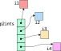

# Punteros

Un puntero es el tipo de variable, por excelencia, que más atemoriza a los desarrolladores _junior_.
Sin embargo, hay algunos conceptos que son clave para comprender este tema:

-   Un puntero es una variable que almacena una dirección de memoria.
-   Todo puntero _sano_ hace referencia a una variable (a través de su dirección de memoria), salvo que sea `#!c NULL`.

Entonces ¿qué es un puntero? Es un tipo de variable que se utiliza para almacenar la dirección de memoria de otras
variables.

## Definición

Para definir una variable de tipo puntero, se utiliza la siguiente expresión:

```
T *pvar;
```

donde `T` es el tipo de la variable apuntada.
De este modo, se cumple lo siguiente:

| **Definición**      | **Descripción**                                                       | **Tamaño**  |
| :------------------ | :-------------------------------------------------------------------- | :---------- |
| `#!c int *x`        | x es una variable de tipo puntero a int (`int *`)                     | 8 bytes     |
| `#!c double *x`     | x es una variable de tipo puntero a double (`double *`)               | 8 bytes     |
| `#!c float *x`      | x es una variable de tipo puntero a float (`float *`)                 | 8 bytes     |
| `#!c char *x`       | x es una variable de tipo puntero a char (`char *`)                   | 8 bytes     |
| `#!c short (*x)[]`  | x es una variable de tipo puntero a arreglo de shorts (`short (*)[]`) | 8 bytes     |
| `#!c char (*x)[]`   | x es una variable de tipo puntero a arreglo de chars (`char (*)[]`)   | 8 bytes     |
| `#!c char **x`      | x es una variable de tipo puntero a puntero a char (`char **`)        | 8 bytes     |
| `#!c char **x`      | x es una variable de tipo doble puntero a char (`char **`)            | 8 bytes     |
| `#!c int ***x`      | x es una variable de tipo triple puntero a int (`int ***`)            | 8 bytes     |
| `#!c int *(*pf)(int *)`     | pf es una variable de tipo puntero a función que recibe un puntero a int y retorna un puntero a int (`int *(*)(int *)`) | 8 bytes     |

Como se ve, se pueden construir variables de tipo puntero con una infinidad de combinaciones.
La página web [cdecl](https://cdecl.org/) sirve para hacer traducciones de definiciones al inglés.
Lo que se debe destacar, es que siempre almacenan una dirección de memoria (o posiblemente basura si no están
inicializados).

## Inicialización y asignación

A una variable de tipo puntero se le deben asignar direcciones de memoria, y para ello es necesario utilizar el operador
`&`, u «operador de dirección».
Este operador, aplicado sobre una variable o función, nos da su dirección de memoria.

Por ejemplo, dado el siguiente código

``` c linenums="1" title="dirop.c"
--8<-- "apuntes/punteros/src/dirop.c"
```

Y el resultado de ejecutar dicho programa puede ser:

``` console
$ gcc -std=c17 -Wall -pedantic -o dirop dirop.c
$ ./dirop
  El valor **almacenado** en ip es: 0xd4
La dirección de memoria de ivar es: 0xd4
  La dirección de memoria de ip es: 0xe0
   La dirección de memoria de c es: 0xd3
  La dirección de memoria de sz es: 0xd8
```

Podemos observar que la variable `ivar` comienza en la posición de memoria `0xd4` (y termina en `0xd8` **no** inclusive
porque ocupa 4 bytes), mientras que `ip` comienza en la dirección de memoria `0xe0` y almacena el valor `0xd4`.
Y esto puede verse en memoria como se muestra en la siguiente figura:

<figure markdown>

<caption>**Fig. 1:** Distribución en memoria de las 4 variables del código anterior.</caption>
</figure>

Pero también podría suceder que la dirección de memoria de `ivar` sea `0x7542ffbc`, mientras que `ip` podría encontrarse
en la dirección de memoria `0x42d9b030` y almacenaría el valor `0x7542ffbc`.
Esto se muestra en la siguiente figura:

<figure markdown>

<caption>**Fig. 2:** Otra posible distribución en memoria de 4 variables.</caption>
</figure>

Como podemos ver, las direcciones de memoria de `ip` y de `ivar` pueden estar distanciadas por más que un par de bytes
(en el ejemplo, son aproximadamente 100 MB de diferencia).
Es decir, un puntero nos sirve para _apuntar_ a direcciones de memoria, cercanas o lejanas.
Esto es realmente importante cuando pensamos en el _scope_ o alcance de las funciones.

## Modificación

Un puntero al que le asignamos una dirección de memoria y no la usamos, no es de mucha utilidad.
Con el puntero, lo que haremos es modificar la variable apuntada.
Para ello usamos el operador `*`, u «operador de indirección».

Siguiendo el caso donde `ip` es un puntero a entero, y particularmente apunta a `ivar`, la sentencia que se utiliza es:

```
*ip = 303;
```

El código completo para modificación de la variable podría ser:

``` c linenums="1" hl_lines="11 11 17 17"
--8<-- "apuntes/punteros/src/dirmod.c"
```

Que al ser compilado y ejecutado muestra lo siguiente:

``` console hl_lines="5 5 8 8"
$ gcc -std=c17 -Wall -pedantic -o dirmod dirmod.c
$ ./dirmod
  El valor **almacenado** en ip es: 0x7ffd9a148b64
La dirección de memoria de ivar es: 0x7ffd9a148b64
    El valor almacenado en ivar es: 10
  El valor **almacenado** en ip es: 0x7ffd9a148b64
La dirección de memoria de ivar es: 0x7ffd9a148b64
    El valor almacenado en ivar es: 303
```

Es importante entender que, al acceder al dato, el compilador entiende que `ip` es un puntero a entero y debe acceder
como un entero.
Por ejemplo, el valor `303` no entra en un byte (un `#!c char`), son necesarios al menos 2.
Como el tipo apuntado por `ip` es un `#!c int` (mejor dicho, como `ip` es un puntero a entero), el compilador entiende
que el dato apuntado ocupa 4 bytes.

!!! example "Ejemplo: apuntado incorrectamente"

    Veamos un código similar al anterior, donde forzamos que `ip`, en lugar de apuntar a `ivar`, al `#!c int`, apunta a
    `c`, el `#!c char`.

    ``` c linenums="1" title="dirmod_w.c"
    --8<-- "apuntes/punteros/src/dirmod_w.c"
    ```

    Lo primero que debemos notar es que al compilar, en este caso, nos muestra un **warning**:

    ``` console title="Compilación de dirmod_w.c"
    $ gcc -std=c17 -Wall -pedantic -o dirmod_w dirmod_w.c
    dirmod_w.c: In function ‘main’:
    dirmod_w.c:11:8: warning: assignment to ‘int *’ from incompatible pointer type ‘char *’ [-Wincompatible-pointer-types]
       11 |     ip = &c;
          |        ^
    ```

    Dicho _warning_ es claro en que estamos asignando direcciones incorrectas al puntero.
    Sin embargo, no podemos depender del compilador para verificar esto y hay que estar atento a los tipos.

    Y en cuanto a la ejecución podemos ver la siguiente salida:


    ``` console title="Resultado de la ejecución del dirmod_w" hl_lines="4 4 6 6 9 9 11 11"
    $ ./dirmod_w
      El valor **almacenado** en ip es: 0x7ffe57c76003
    La dirección de memoria de ivar es: 0Antesx7ffe57c76004
        El valor almacenado en ivar es: 10
       La dirección de memoria de c es: 0x7ffe57c76003
           El valor almacenado en c es: a
      El valor **almacenado** en ip es: 0x7ffe57c76003
    La dirección de memoria de ivar es: 0x7ffe57c76004
        El valor almacenado en ivar es: 1
       La dirección de memoria de c es: 0x7ffe57c76003
           El valor almacenado en c es: /
    ```

    ¡Se modificaron 2 variables! Y se debe a que el valor asignado no cabe en el `#!c char` apuntado y sobreescribe
    parte del `#!c int` que se encontraba a continuación.

    La siguiente figura ejemplifica, en memoria, lo sucedido:

    <figure markdown>
    
    <caption>**Fig. 3:** Antes de la asignación.</caption>
    </figure>

    <figure markdown>
    
    <caption>**Fig. 4:** Después de la asignación.</caption>
    </figure>

    ¿Qué ocurriría en el caso contrario, donde apuntamos a una dirección con un dato más grande que el esperada, por
    ejemplo, si apuntásemos a la variable `sz` con `ip = &sz;`?

## Punteros y arreglos

En C, cuando se define un arreglo, estático, del siguiente modo:

``` c
bool flags[4];
```

estamos creando una variable, un arreglo, de 4 `#!c bool`s.
Esto implica que en memoria tenemos 4 `#!c bool`s contiguos, y `flags` almacena la dirección de memoria del primer
elemento.
De ese modo, cuando accedemos utilizando el operador `[]`, como en `#!c flags[1] = true;` el compilador entiende que
`flags` es un arreglo de booleanos (que ocupan un byte cada uno) y sabe que si el primer elemento está en la posición de
memoria `0xf0`, el elemento `flags[1]` está en la posición de memoria `0xf1`.

!!! tip "Chequeando las direcciones"

    Escribir un programa que cree un arreglo de booleanos e imprima las direcciones de memoria de cada elemento,
    utilizando `&arreglo[i]`.

Si el arreglo `flags` en vez de estar definido con `bool`s estuviera definido con `#!c int`s, ocurre lo mismo: el
compilador sabe cuántos bytes ocupa cada elemento del arreglo y sabe que al acceder a `arreglo[3]` debe ir a la posición
de memoria `0xf0 + 3 * sizeof(int)`, es decir, `0xfc`.

Esta forma de operar es muy similar a lo visto con los punteros, donde el compilador sabe que si escribimos la expresión
`*ip` estamos accediendo a una variable de tipo `#!c int` que ocupa 4 bytes.
Pero `ip`, al igual que `flags`, es una variable que almacena **una dirección de memoria**.
A partir de la dirección de memoria dada, podría haber 1 `#!c int` o 100 `#!c int`s ¿cómo podemos saberlo?
Lo sabemos porque nosotros lo programamos, u otra variable nos los indicó (o en el caso de las cadenas, porque hay un
`'\0'` esperándonos).

!!! example "Iterando arreglos"

    Veamos los códigos siguientes:

    === "Iteración 1"

        ``` c linenums="1" title="iteracion1.c"
        --8<-- "apuntes/punteros/src/iteracion1.c"
        ```

        ``` console title="Ejecución"
        $ gcc -std=c17 -Wall -pedantic -o it1 iteracion1.c
        $ ./it1
        0 1 2 3 4
        ```

        Es la iteración típica que vimos en la sección de [arreglos](../arrays).

    === "Iteración 2"

        ``` c linenums="1" title="iteracion2.c"
        --8<-- "apuntes/punteros/src/iteracion2.c"
        ```

        ``` console title="Ejecución"
        $ gcc -std=c17 -Wall -pedantic -o it2 iteracion2.c
        $ ./it2
        0 1 2 3 4
        ```

        Aquí vemos que podemos almacenar la dirección de memoria del primer elemento de `v` en `ip` e iterar como si
        `ip` fuese un arreglo.
        En este caso, se dice que la variable `v` decae a puntero al almacenar su contenido en el puntero.

    === "Iteración 3"

        ``` c linenums="1" title="iteracion3.c"
        --8<-- "apuntes/punteros/src/iteracion3.c"
        ```

        ``` console title="Ejecución"
        $ gcc -std=c17 -Wall -pedantic -o it3 iteracion3.c
        $ ./it3
        0x7ffd57527bc0
        0x7ffd57527bc4
        0x7ffd57527bc8
        0x7ffd57527bcc
        0x7ffd57527bd0
        ```

        Aquí podemos ver las direcciones de memoria de cada elemento del arreglo.
        Vemos que la primera comienza en `0x7ffd57527bc0` y a partir de ese momento, avanzan de 4 bytes.

    === "Iteración 4"

        ``` c linenums="1" title="iteracion4.c"
        --8<-- "apuntes/punteros/src/iteracion4.c"
        ```

        ``` console title="Ejecución"
        $ gcc -std=c17 -Wall -pedantic -o it4 iteracion4.c
        $ ./it4
        0 1 2 3 4
        ```

        :scream:

        ¿Por qué sale `0 1 2 3 4` si `ip` almacena una dirección de memoria, y en "Iteración 3" vimos que aumentan de 4
        (`#!c sizeof(int)`) estas direcciones?
        Porque el compilador es "inteligente" y entiende que no estamos interesados en la diferencia de las direcciones,
        sino en cuántos `#!c int`s hay entre los punteros.
        Para ello, claro está, esa diferencia debería ser válida, es decir, debería darse con direcciones de emoria en
        un arreglo o, al menos, con enteros de por medio.

## Arreglos de punteros

Así como tenemos los arreglos de tipos básicos, como arreglos de enteros o arreglos de doubles, podemos tener arreglos
de punteros.
Un arreglo de punteros es una variable, un arreglo, cuyos elementos son punteros a otros tipos de datos.
Por ejemplo, podemos definir

``` c
double *pvector[];
```

que define un arreglo de punteros a `#!c double`.
Veremos que estos tipos tienen una utilidad variada, pero no aproximaremos a ellos con tipos conocidos.
También es importante distinguir la definición anterior de la siguiente:

``` c
double (*var)[];
```

donde, si seguimos las convención de lectura dada para la definición de variables (primero resolvemos paréntesis y luego
de izquierda a derecha), vemos que `var` declara un puntero a un arreglo de doubles.

Para mostrar su uso, lo primero que haremos es definir un conjunto de variables de tipo `#!c int`, y un arreglo de
punteros a ellas.
Para ello, lo que haríamos sería escribir el siguiente código:

``` c linenums="1" title="Inicialización de vector de punteros"
int i1 = 11;
int i2 = 21;
int i3 = 31;
int i4 = 41;
int *p2ints[] = {&i1, &i2, &i3, &i4};
```

Podemos ver que al definir el arreglo `p2ints` lo estamos inicializando con las direcciones de memoria de las variables
antes definidas.
Podríamos, en vez de asignarle dichos punteros, inicializarlo con punteros nulos, es decir, con la constante `#!c NULL`.
El siguiente extracto de código muestra dicha inicialización y la siguiente asignación de los punteros, para obtener el
mismo resultado que en el código anterior:

``` c linenums="1" title="Inicialización de punteros a NULL"
int i1 = 11;
int i2 = 21;
int i3 = 31;
int i4 = 41;
int *p2ints[] = {NULL, NULL, NULL, NULL};

p2ints[0] = &i1;
p2ints[1] = &i2;
p2ints[2] = &i3;
p2ints[3] = &i4;
```

Estas variables se distribuyen en memoria como se muestra en la figura 5, a continuación.

<figure markdown>

<caption>**Fig. 5:** Esquema de memoria en la inicialización de las variables.</caption>
</figure>

Sin embargo, como mencionamos anteriormente, podemos pensar a la memoria como un arreglo continuo de bytes, pero
comienza a ser engorroso realizar estos diagramas, por lo que es mejor hacerlo como se muestra en la siguiente figura:

<figure markdown>

<caption>**Fig. 6:** Ubicación de las variables en un diagrama de memoria.</caption>
</figure>

Estos diagramas buscan ser representaciones fieles de la distribución de las variables en memoria, sus tamaños y sus
valores.
No obstante, suele ser más práctico trabajar con diagramas donde identificamos las variables, identificamos si son
arreglos o no, y esquematizamos la relación, como se muestra en la figura 7.

<figure markdown>

<caption>**Fig. 7:** Esquema de punteros.</caption>
</figure>

Podemos ver que todas las variables, independientemente del tipo, fueron dibujadas con un cuadrado, los arreglos con
varios cuadrados, y los punteros con flechas hacia las variables a las que apuntan.

!!! example "Ejemplo: Creando, cargando y usando un vector de punteros"

    En el siguiente código estamos creando un arreglo de punteros a `#!c double`, cargándolo con las direcciones de
    memoria de otras variables y, a través del arreglo de punteros, guardamos en dichas variables valores convertidos a
    según el ingreso del usuario.
    Luego, nuevamente a través del vector, imprimimos los valores y calculamos el máximo del arreglo con una función
    llamadas `maximo`.

    ``` c linenums="1"
    --8<-- "apuntes/punteros/src/ptr_array.c"
    ```

Si volvemos sobre la figura 7, podemos ver que el contenido del arreglo de punteros son direcciones de memoria que
apuntan a un entero (por el ejemplo dado).
Y podemos recordar que un arreglo, el nombre de un arreglo, almacena la dirección de memoria del primer elemento del
arreglo.
Si unimos estos dos conceptos, vemos que no podemos saber (sin más información), si cada elemento del arreglo de
punteros apunta a una variable entera o a una secuencia de variables, es decir, a un arreglo.
Es por esto que podemos construir, utilizando la misma sintaxis anterior, arreglos de arreglos.

Definamos primero las filas de una matriz en variables separadas, del siguiente modo:

``` c
float fila0[] = {11, 12, 13, 14, 15};
float fila1[] = {21, 22, 23, 24, 25};
float fila2[] = {31, 32, 33, 34, 35};
float fila3[] = {41, 42, 43, 44, 45};
```

Luego, podemos definir la variable matriz, como un arreglo de punteros, donde cada elemento del arreglo es un puntero a
la fila correspondiente:

``` c
float *matriz[] = {fila0, fila1, fila2, fila3};
```

A diferencia del caso en que sólo apuntamos a una variable, aquí no utilizamos el operador `&` en la asignación de los
valores del arreglo de punteros `matriz`.
Esto se debe a que las variables `fila0`, `fila` y `fila2` ya son punteros (¿por qué?), y si tomásemos su dirección de
memoria obtendríamos punteros dobles.

Esquemáticamente, esto lo podemos ver como se muestra en la figura 8.

<figure markdown>

<caption>**Fig. 8:** Matriz formada como arreglo de punteros.</caption>
</figure>

La forma de utilizar esta matriz es similar a las matrices creadas con memoria contigua (`#!c float matriz[4][5];`).
Entre las diferencias podemos ver que esta matriz requiere más memoria, para almacenar el arreglo de punteros (lo es que
una desventaja), pero nos permite no tener toda la memoria contigua (ventaja).
Sin embargo, sí presenta como desventaja que para acceder a un elemento de la matriz, necesita acceder al vector de
punteros para obtener la dirección de la fila, y una vez que tiene la dirección de la fila, acceder nuevamente para
obtener el elemento.
En las matrices estáticas, el mismo acceso se resuelve sumando una determinada cantidad de bytes a la posición inicial.
Esta diferencia viene, justamente, de que las filas pueden estar en cualquier dirección de memoria, y no es posible
saber en dónde hasta no acceder al vector de punteros para ver su contenido.
Una última ventaja que tienen los arreglos, o matrices, formados con punteros (los arreglos de punteros), es que cada
elemento es un puntero a una dirección de memoria donde puede haber una cantidad distinta de elementos para cada
dirección.
Por ejemplo, la primera fila podría contener 10 elementos, mientras que la segunda 5.
Claro está que esto tendrá sentido únicamente en la aplicación donde se lo utilice; una matriz siempre tendrá igual
cantidad de columnas en cada fila, pero un arreglo de cadenas (como veremos más adelante) no tiene por qué tener igual
cantidad de elementos en cada fila, en cada cadena.

!!! example "Ejemplo: punteros dobles como matrices"

    En el siguiente ejemplo vemos cómo se crea, carga y utiliza una matriz, formada a partir de un arreglo de punteros.
    Veremos que es muy similar al ejemplo anterior.

    ``` c linenums="1"
    --8<-- "apuntes/punteros/src/ptr_array_2.c"
    ```

### Arreglos de cadenas

Un caso particular de los arreglos de punteros es el de arreglos de cadenas.
Como vimos, un literal de cadena, por ejemplo `#!c "Patricio"` es un arreglo de `#!c char` terminado en `#!c '\0'` y
ubicado en una posición de memoria constante.
No lo podemos modificar.
Al definir una variable como:

``` c
char *cadena = "Patricio";
```

estamos guardando el literal en el espacio de memoria mencionado, y **la dirección donde está almacenada la `#! 'P'`**
en la variable `cadena`.
Es decir, `cadena` es un puntero a char.
También podemos definir un arreglo de cadenas como

``` c
char *nombre[] = {"Patricio", "Moreno"};
```

con lo cual cargamos en `nombre[0]` una dirección de memoria y en `nombre[1]` otra dirección.
Esto nos permite operar con cadenas que se encuentran en un arreglo, y a cada una de ellas se puede acceder mediante
`nombre_del_arreglo[i]`.

!!! example "Ejemplo: disculpe ¿tiene ..."

    Supongamos que tenemos un arreglo definido como

    ``` c
    char *items[] = {"banana", "pera", "manzana", "apio", "tomate", "caqui", "mora", "hinojo", "alcachofa"};
    ```

    y queremos escribir una función que dado un arreglo de cadenas como el mencionado y el nombre de una fruta/verdura,
    nos dice si se encuentra en el arreglo.

    La función que implementaríamos sería similar a la siguiente:

    ``` c linenums="1"
    ssize_t find(const char *items[], ssize_t l, const char *item)
    {
        for (ssize_t i = 0; i < l; ++i) {
            if (!strcmp(items[i], item)) {
                return i;
            }
        }
        return -1;
    }
    ```

    y su uso sería: `#!c pos = find(items, 9, "mora");`.

    Notemos que, al igual que en los otros casos (y como casi siempre que trabajamos con arreglos), necesitamos pasarle
    a la función la cantidad de elementos que hay en el arreglo.
    Sin embargo, hay un valor de puntero especial que indica que un puntero no está asignado y/o no apunta a una
    dirección válida: `#!c NULL`.
    Aprovechando esta definición, podemos agregar como último elemento del arreglo, el valor `#!c NULL` como un
    centinela de fin del arreglo, similar a cómo funciona `#!c '\0'` para las cadenas.

    Entonces, podemos redefinir el arreglo anterior del siguiente modo

    ``` c
    char *items[] = {"banana", "pera", "manzana", "apio", "tomate", "caqui", "mora", "hinojo", "alcachofa", NULL};
    ```

    y reimplementar la función aprovechando dicha definición:

    ``` c linenums="1"
    ssize_t find(char *items[], const char *item)
    {
        for (ssize_t i = 0; NULL != items[i]; ++i) {
            if (!strcmp(items[i], item)) {
                return i;
            }
        }
        return -1;
    }
    ```

    Finalmente, haciendo un uso avanzado de los punteros, podriamos reescribir la función del siguiente modo:

    ``` c linenums="1"
    char **find(char *items[], const char *item)
    {
        for (char **iut = items; NULL != *iut; ++iut) {
            if (!strcmp(*iut, item)) {
                return iut;
            }
        }
        return NULL;
    }
    ```

    Se recomienda leer detenidamente dicha función y asegurar su comprensión.

## Punteros y funciones

Al pasar variables a las funciones podemos hacerlo por copia, en donde copiamos todo el contenido de la variable al
stack de la función, o por puntero, en cuyo caso sólo copiamos **la dirección** de la variable.
Al copiar la dirección de la variable, desde la función tenemos acceso a la variable, lo que nos permite modificarla.

Un primer ejemplo en el que utilizamos punteros para las funciones es cuando utilizamos arreglos.
Por ejemplo, si implementamos una función para calcular el valor medio de un arreglo de `#!c double`s:

``` c title="meand.c" linenums="1"
--8<-- "apuntes/punteros/src/meand.c"
```

Veamos qué ocurre al ejecutarla:

``` c title="Test meand.c" linenums="1"
--8<-- "apuntes/punteros/src/test_meand.c"
```

``` console title="Compilación y ejecución"
$ gcc -std=c17 -Wall -pedantic -c -o meand.o meand.c
$ gcc -std=c17 -Wall -pedantic -c -o test_meand.o test_meand.c
$ gcc -std=c17 -Wall -pedantic    -o test_meand test_meand.o meand.o
$ ./test_meand
Mean: 245.78
```

Y vemos que la ejecución es correcta.
¿Pero qué ocurre en la siguientes prueba?

=== "Array de largo cero"

    ``` c title="Test meand.c con array de largo cero" linenums="1"
    --8<-- "apuntes/punteros/src/test_zero_meand.c"
    ```

    ``` console title="Compilación y ejecución" hl_lines="5"
    $ gcc -std=c17 -Wall -pedantic -c -o meand.o meand.c
    $ gcc -std=c17 -Wall -pedantic -c -o test_zero_meand.o test_zero_meand.c
    $ gcc -std=c17 -Wall -pedantic    -o test_zero_meand test_zero_meand.o meand.o
    $ ./test_zero_meand
    Mean: -nan
    ```

=== "`#!c NULL` como array"

    ``` c title="Test meand.c con NULL" linenums="1"
    --8<-- "apuntes/punteros/src/test_null_meand.c"
    ```

    ``` console title="Compilación y ejecución" hl_lines="5"
    $ gcc -std=c17 -Wall -pedantic -c -o meand.o meand.c
    $ gcc -std=c17 -Wall -pedantic -c -o test_null_meand.o test_null_meand.c
    $ gcc -std=c17 -Wall -pedantic    -o test_null_meand test_null_meand.o meand.o
    $ ./test_null_meand
    Segmentation fault (core dumped)
    ```

Como podemos ver, la función no opera correctamente, pero son situaciones que podríamos detectar.

Para ver si el largo es cero usaríamos:

``` c
if (0 == length) { ... }
```

Y para ver si `array` es `#!c NULL`, podríamos usar:

``` c
if (NULL == array) { ... }
```

pero el prototipo de nuestra función es `#!c double meand(double *, size_t);` ¿qué devolvemos en estos casos de error?
¿-1? Podría ser el valor medio ¿0? También.
Cualquier valor podría ser el valor medio calculado, necesitamos otra forma de hacerlo.
Punteros al rescate.

Lo que haremos es pasarle la dirección de memoria de una variable donde queremos almacenar el resultado, y como valor de
retorno indicaremos si lo pudimos calcular o no.
Para ello, modificamos el código de `meand()` como se muestra a continuación:

``` c title="meand_ok.c" linenums="1"
--8<-- "apuntes/punteros/src/meand_ok.c"
```

Cuyo "test" completo es:

``` c title="meand_ok.c" linenums="1"
--8<-- "apuntes/punteros/src/test_meand_ok.c"
```

``` console title="Compilación y ejecución"
$ gcc -std=c17 -Wall -pedantic -c -o meand_ok.o meand_ok.c
$ gcc -std=c17 -Wall -pedantic -c -o test_meand_ok.o test_meand_ok.c
$ gcc -std=c17 -Wall -pedantic    -o test_meand_ok test_meand_ok.o meand_ok.o
$ ./test_meand_ok
Prueba con valores típicos:
        Mean: 245.78
Prueba con arreglo de largo 0:
        No se pudo calcular la media (posiblemente el largo 0 tenga algo que ver)
Prueba con arreglo NULL:
        No se pudo calcular la media (posiblemente el puntero nulo tenga algo que ver)
```

!!! tip "`#!c int` como valor de retorno"

    En la función `meand()`, retornar un `#!c int` no es lo más favorable, ya que se dificulta comprender el código en
    la archivo de pruebas.
    Para eso, podemos definir nuestro propio tipo de datos

    ``` c title="status.h" linenums="1"
    #pragma once

    typedef enum {
        ST_OK,
        ST_ERR_NULL_PTR,
        ST_ERR_LZERO_ARRAY,
        ST_ERR_INVALID_ARG,
        ST_ERR_UNKNOWN,
    } status_t;
    ```

    El tipo definido internamente es un `#!c int`, pero es irrelevante ya que lo que nos interesa es que el mensaje sea
    claro.
    Veamos su uso en los siguientes archivos:

    === "`status.h`"

        ``` c title="status.h" linenums="1"
        --8<-- "apuntes/punteros/src/status.h"
        ```

    === "`meand.h`"

        ``` c title="meand.h" linenums="1"
        --8<-- "apuntes/punteros/src/meand.h"
        ```

    === "`meand.c`"

        ``` c title="meand.c" linenums="1"
        --8<-- "apuntes/punteros/src/meand_st.c"
        ```

    === "`test.c`"

        ``` c title="test.c" linenums="1"
        --8<-- "apuntes/punteros/src/test_st.c"
        ```

    === "Compilación y ejecución"

        ``` console
        $ gcc -std=c17 -Wall -pedantic -c -o meand.o meand.c
        $ gcc -std=c17 -Wall -pedantic -c -o test.o test.c
        $ gcc -std=c17 -Wall -pedantic    -o test test.o meand.o
        $ ./test
        Prueba con valores típicos:
                Mean: 245.78
        Prueba con arreglo de largo 0:
                No se pudo calcular la media (posiblemente el largo 0 tenga algo que ver)
        Prueba con arreglo NULL:
                No se pudo calcular la media (posiblemente el puntero nulo tenga algo que ver)
        ```

## Biblioteca estándar para manejo de punteros

No hay ninguna biblioteca estándar para la manipulación de punteros.

## Guías de ejercicios

La guía de ejercicios de punteros se encuentra [aquí](../../guias/c/punteros/).
