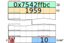

# Punteros

Un puntero es el tipo de variable, por excelencia, que más atemoriza a los desarrolladores _junior_.
Sin embargo, hay algunos conceptos que son clave para comprender este tema:

-   Un puntero es una variable que almacena una dirección de memoria.
-   Todo puntero _sano_ hace referencia a una variable (a través de su dirección de memoria), salvo que sea `#!c NULL`.

Entonces ¿qué es un puntero? Es un tipo de variable que se utiliza para almacenar la dirección de memoria de otras
variables.

## Definición

Para definir una variable de tipo puntero, se utiliza la siguiente expresión:

```
T *pvar;
```

donde `T` es el tipo de la variable apuntada.
De este modo, se cumple lo siguiente:

| **Definición**      | **Descripción**                                                       | **Tamaño**  |
| :------------------ | :-------------------------------------------------------------------- | :---------- |
| `#!c int *x`        | x es una variable de tipo puntero a int (`int *`)                     | 8 bytes     |
| `#!c double *x`     | x es una variable de tipo puntero a double (`double *`)               | 8 bytes     |
| `#!c float *x`      | x es una variable de tipo puntero a float (`float *`)                 | 8 bytes     |
| `#!c char *x`       | x es una variable de tipo puntero a char (`char *`)                   | 8 bytes     |
| `#!c short (*x)[]`  | x es una variable de tipo puntero a arreglo de shorts (`short (*)[]`) | 8 bytes     |
| `#!c char (*x)[]`   | x es una variable de tipo puntero a arreglo de chars (`char (*)[]`)   | 8 bytes     |
| `#!c char **x`      | x es una variable de tipo puntero a puntero a char (`char **`)        | 8 bytes     |
| `#!c char **x`      | x es una variable de tipo doble puntero a char (`char **`)            | 8 bytes     |
| `#!c int ***x`      | x es una variable de tipo triple puntero a int (`int ***`)            | 8 bytes     |
| `#!c int *(*pf)(int *)`     | pf es una variable de tipo puntero a función que recibe un puntero a int y retorna un puntero a int (`int *(*)(int *)`) | 8 bytes     |

Como se ve, se pueden construir variables de tipo puntero con una infinidad de combinaciones.
La página web [cdecl](https://cdecl.org/) sirve para hacer traducciones de definiciones al inglés.
Lo que se debe destacar, es que siempre almacenan una dirección de memoria (o posiblemente basura si no están
inicializados).

## Inicialización y asignación

A una variable de tipo puntero se le deben asignar direcciones de memoria, y para ello es necesario utilizar el operador
`&`, u «operador de dirección».
Este operador, aplicado sobre una variable o función, nos da su dirección de memoria.

Por ejemplo, dado el siguiente código

``` c linenums="1" title="dirop.c"
--8<-- "apuntes/punteros/dirop.c"
```

Y el resultado de ejecutar dicho programa puede ser:

``` console
$ gcc -std=c17 -Wall -pedantic -o dirop dirop.c
$ ./dirop 
  El valor **almacenado** en ip es: 0xd4
La dirección de memoria de ivar es: 0xd4
  La dirección de memoria de ip es: 0xe0
   La dirección de memoria de c es: 0xd3
  La dirección de memoria de sz es: 0xd8
```

Podemos observar que la variable `ivar` comienza en la posición de memoria `0xd4` (y termina en `0xd8` **no** inclusive
porque ocupa 4 bytes), mientras que `ip` comienza en la dirección de memoria `0xe0` y almacena el valor `0xd4`.
Y esto puede verse en memoria como se muestra en la siguiente figura:

<figure markdown>

<caption>**Fig. 1:** Distribución en memoria de las 4 variables del código anterior.</caption>
</figure>

Pero también podría suceder que la dirección de memoria de `ivar` sea `0x7542ffbc`, mientras que `ip` podría encontrarse
en la dirección de memoria `0x42d9b030` y almacenaría el valor `0x7542ffbc`.
Esto se muestra en la siguiente figura:

<figure markdown>

<caption>**Fig. 2:** Otra posible distribución en memoria de 4 variables.</caption>
</figure>

Como podemos ver, las direcciones de memoria de `ip` y de `ivar` pueden estar distanciadas por más que un par de bytes
(en el ejemplo, son aproximadamente 100 MB de diferencia).
Es decir, un puntero nos sirve para _apuntar_ a direcciones de memoria, cercanas o lejanas.
Esto es realmente importante cuando pensamos en el _scope_ o alcance de las funciones.

## Modificación

Un puntero al que le asignamos una dirección de memoria y no la usamos, no es de mucha utilidad.
Con el puntero, lo que haremos es modificar la variable apuntada.
Para ello usamos el operador `*`, u «operador de indirección».

Siguiendo el caso donde `ip` es un puntero a entero, y particularmente apunta a `ivar`, la sentencia que se utiliza es:

```
*ip = 303;
```

El código completo para modificación de la variable podría ser:

``` c linenums="1" hl_lines="11 11 17 17"
--8<-- "apuntes/punteros/dirmod.c"
```

Que al ser compilado y ejecutado muestra lo siguiente:

``` console hl_lines="5 5 8 8"
$ gcc -std=c17 -Wall -pedantic -o dirmod dirmod.c 
$ ./dirmod 
  El valor **almacenado** en ip es: 0x7ffd9a148b64
La dirección de memoria de ivar es: 0x7ffd9a148b64
    El valor almacenado en ivar es: 10
  El valor **almacenado** en ip es: 0x7ffd9a148b64
La dirección de memoria de ivar es: 0x7ffd9a148b64
    El valor almacenado en ivar es: 303
```

Es importante entender que, al acceder al dato, el compilador entiende que `ip` es un puntero a entero y debe acceder
como un entero.
Por ejemplo, el valor `303` no entra en un byte (un `#!c char`), son necesarios al menos 2.
Como el tipo apuntado por `ip` es un `#!c int` (mejor dicho, como `ip` es un puntero a entero), el compilador entiende que
el dato apuntado ocupa 4 bytes.

!!! example "Ejemplo: apuntado incorrectamente"

    Veamos un código similar al anterior, donde forzamos que `ip`, en lugar de apuntar a `ivar`, al `#!c int`, apunta a `c`,
    el `#!c char`.

    ``` c linenums="1" title="dirmod_w.c"
    --8<-- "apuntes/punteros/dirmod_w.c"
    ```

    Lo primero que debemos notar es que al compilar, en este caso, nos muestra un **warning**:

    ``` console title="Compilación de dirmod_w.c"
    $ gcc -std=c17 -Wall -pedantic -o dirmod_w dirmod_w.c 
    dirmod_w.c: In function ‘main’:
    dirmod_w.c:11:8: warning: assignment to ‘int *’ from incompatible pointer type ‘char *’ [-Wincompatible-pointer-types]
       11 |     ip = &c;
          |        ^
    ```

    Dicho _warning_ es claro en que estamos asignando direcciones incorrectas al puntero.
    Sin embargo, no podemos depender del compilador para verificar esto y hay que estar atento a los tipos.

    Y en cuanto a la ejecución podemos ver la siguiente salida:


    ``` console title="Resultado de la ejecución del dirmod_w" hl_lines="4 4 6 6 9 9 11 11"
    $ ./dirmod_w 
      El valor **almacenado** en ip es: 0x7ffe57c76003
    La dirección de memoria de ivar es: 0Antesx7ffe57c76004
        El valor almacenado en ivar es: 10
       La dirección de memoria de c es: 0x7ffe57c76003
           El valor almacenado en c es: a
      El valor **almacenado** en ip es: 0x7ffe57c76003
    La dirección de memoria de ivar es: 0x7ffe57c76004
        El valor almacenado en ivar es: 1
       La dirección de memoria de c es: 0x7ffe57c76003
           El valor almacenado en c es: /
    ```

    ¡Se modificaron 2 variables! Y se debe a que el valor asignado no cabe en el `#!c char` apuntado y sobreescribe parte
    del `#!c int` que se encontraba a continuación.

    La siguiente figura ejemplifica, en memoria, lo sucedido:

    <figure markdown>
    
    <caption>**Fig. 3:** Antes de la asignación.</caption>
    </figure>

    <figure markdown>
    
    <caption>**Fig. 4:** Después de la asignación.</caption>
    </figure>

    ¿Qué ocurriría en el caso contrario, donde apuntamos a una dirección con un dato más grande que el esperada, por
    ejemplo, si apuntásemos a la variable `sz` con `ip = &sz;`?

## Punteros y arreglos

En C, cuando se define un arreglo, estático, del siguiente modo:

``` c
bool flags[4];
```

estamos creando una variable, un arreglo, de 4 `#!c bool`s.
Esto implica que en memoria tenemos 4 `#!c bool`s contiguos, y `flags` almacena la dirección de memoria del primer
elemento.
De ese modo, cuando accedemos utilizando el operador `[]`, como en `#!c flags[1] = true;` el compilador entiende que
`flags` es un arreglo de booleanos (que ocupan un byte cada uno) y sabe que si el primer elemento está en la posición de
memoria `0xf0`, el elemento `flags[1]` está en la posición de memoria `0xf1`.

!!! tip "Chequeando las direcciones"

    Escribir un programa que cree un arreglo de booleanos e imprima las direcciones de memoria de cada elemento,
    utilizando `&arreglo[i]`.

Si el arreglo `flags` en vez de estar definido con `bool`s estuviera definido con `#!c int`s, ocurre lo mismo: el compilador
sabe cuántos bytes ocupa cada elemento del arreglo y sabe que al acceder a `arreglo[3]` debe ir a la posición de memoria
`0xf0 + 3 * sizeof(int)`, es decir, `0xfc`.

Esta forma de operar es muy similar a lo visto con los punteros, donde el compilador sabe que si escribimos la expresión
`*ip` estamos accediendo a una variable de tipo `#!c int` que ocupa 4 bytes.
Pero `ip`, al igual que `flags`, es una variable que almacena **una dirección de memoria**.
A partir de la dirección de memoria dada, podría haber 1 `#!c int` o 100 `#!c int`s ¿cómo podemos saberlo?
Lo sabemos porque nosotros lo programamos, u otra variable nos los indicó (o en el caso de las cadenas, porque hay un
`'\0'` esperándonos).

!!! example "Iterando arreglos"

    Veamos los códigos siguientes:

    === "Iteración 1"

        ``` c linenums="1" title="iteracion1.c"
        --8<-- "apuntes/punteros/iteracion1.c"
        ```

        ``` console title="Ejecución"
        $ gcc -std=c17 -Wall -pedantic -o it1 iteracion1.c 
        $ ./it1
        0 1 2 3 4
        ```

        Es la iteración típica que vimos en la sección de [arreglos](../arrays).

    === "Iteración 2"

        ``` c linenums="1" title="iteracion2.c"
        --8<-- "apuntes/punteros/iteracion2.c"
        ```

        ``` console title="Ejecución"
        $ gcc -std=c17 -Wall -pedantic -o it2 iteracion2.c 
        $ ./it2
        0 1 2 3 4
        ```

        Aquí vemos que podemos almacenar la dirección de memoria del primer elemento de `v` en `ip` e iterar como si
        `ip` fuese un arreglo.
        En este caso, se dice que la variable `v` decae a puntero al almacenar su contenido en el puntero.

    === "Iteración 3"

        ``` c linenums="1" title="iteracion3.c"
        --8<-- "apuntes/punteros/iteracion3.c"
        ```

        ``` console title="Ejecución"
        $ gcc -std=c17 -Wall -pedantic -o it3 iteracion3.c 
        $ ./it3
        0x7ffd57527bc0
        0x7ffd57527bc4
        0x7ffd57527bc8
        0x7ffd57527bcc
        0x7ffd57527bd0
        ```

        Aquí podemos ver las direcciones de memoria de cada elemento del arreglo.
        Vemos que la primera comienza en `0x7ffd57527bc0` y a partir de ese momento, avanzan de 4 bytes.

    === "Iteración 4"

        ``` c linenums="1" title="iteracion4.c"
        --8<-- "apuntes/punteros/iteracion4.c"
        ```

        ``` console title="Ejecución"
        $ gcc -std=c17 -Wall -pedantic -o it4 iteracion4.c 
        $ ./it4
        0 1 2 3 4
        ```

        :scream:

        ¿Por qué sale `0 1 2 3 4` si `ip` almacena una dirección de memoria, y en "Iteración 3" vimos que aumentan de 4
        (`#!c sizeof(int)`) estas direcciones?
        Porque el compilador es "inteligente" y entiende que no estamos interesados en la diferencia de las direcciones,
        sino en cuántos `#!c int`s hay entre los punteros.
        Para ello, claro está, esa diferencia debería ser válida, es decir, debería darse con direcciones de emoria en
        un arreglo o, al menos, con enteros de por medio.

## Punteros y funciones

Al pasar variables a las funciones podemos hacerlo por copia, en donde copiamos todo el contenido de la variable al
stack de la función, o por puntero, en cuyo caso sólo copiamos **la dirección** de la variable.
Al copiar la dirección de la variable, desde la función tenemos acceso a la variable, lo que nos permite modificarla.

Un primer ejemplo en el que utilizamos punteros para las funciones es cuando utilizamos arreglos.
Por ejemplo, si implementamos una función para calcular el valor medio de un arreglo de `#!c double`s:

``` c title="meand.c" linenums="1"
--8<-- "apuntes/punteros/meand.c"
```

Veamos qué ocurre al ejecutarla:

``` c title="Test meand.c" linenums="1"
--8<-- "apuntes/punteros/test_meand.c"
```

``` console title="Compilación y ejecución"
$ gcc -std=c17 -Wall -pedantic -c -o meand.o meand.c
$ gcc -std=c17 -Wall -pedantic -c -o test_meand.o test_meand.c
$ gcc -std=c17 -Wall -pedantic    -o test_meand test_meand.o meand.o
$ ./test_meand 
Mean: 245.78
```

Y vemos que la ejecución es correcta.
¿Pero qué ocurre en la siguientes prueba?

=== "Array de largo cero"

    ``` c title="Test meand.c con array de largo cero" linenums="1"
    --8<-- "apuntes/punteros/test_zero_meand.c"
    ```
    
    ``` console title="Compilación y ejecución" hl_lines="5"
    $ gcc -std=c17 -Wall -pedantic -c -o meand.o meand.c
    $ gcc -std=c17 -Wall -pedantic -c -o test_zero_meand.o test_zero_meand.c
    $ gcc -std=c17 -Wall -pedantic    -o test_zero_meand test_zero_meand.o meand.o
    $ ./test_zero_meand 
    Mean: -nan
    ```

=== "`#!c NULL` como array"

    ``` c title="Test meand.c con NULL" linenums="1"
    --8<-- "apuntes/punteros/test_null_meand.c"
    ```
    
    ``` console title="Compilación y ejecución" hl_lines="5"
    $ gcc -std=c17 -Wall -pedantic -c -o meand.o meand.c
    $ gcc -std=c17 -Wall -pedantic -c -o test_null_meand.o test_null_meand.c
    $ gcc -std=c17 -Wall -pedantic    -o test_null_meand test_null_meand.o meand.o
    $ ./test_null_meand 
    Segmentation fault (core dumped)
    ```

Como podemos ver, la función no opera correctamente, pero son situaciones que podríamos detectar.

Para ver si el largo es cero usaríamos:

``` c
if (0 == length) { ... }
```

Y para ver si `array` es `#!c NULL`, podríamos usar:

``` c
if (NULL == array) { ... }
```

pero el prototipo de nuestra función es `#!c double meand(double *, size_t);` ¿qué devolvemos en estos casos de error?
¿-1? Podría ser el valor medio ¿0? También.
Cualquier valor podría ser el valor medio calculado, necesitamos otra forma de hacerlo.
Punteros al rescate.

Lo que haremos es pasarle la dirección de memoria de una variable donde queremos almacenar el resultado, y como valor de
retorno indicaremos si lo pudimos calcular o no.
Para ello, modificamos el código de `meand()` como se muestra a continuación:

``` c title="meand_ok.c" linenums="1"
--8<-- "apuntes/punteros/meand_ok.c"
```

Cuyo "test" completo es:

``` c title="meand_ok.c" linenums="1"
--8<-- "apuntes/punteros/test_meand_ok.c"
```

``` console title="Compilación y ejecución"
$ gcc -std=c17 -Wall -pedantic -c -o meand_ok.o meand_ok.c
$ gcc -std=c17 -Wall -pedantic -c -o test_meand_ok.o test_meand_ok.c 
$ gcc -std=c17 -Wall -pedantic    -o test_meand_ok test_meand_ok.o meand_ok.o
$ ./test_meand_ok 
Prueba con valores típicos:
        Mean: 245.78
Prueba con arreglo de largo 0:
        No se pudo calcular la media (posiblemente el largo 0 tenga algo que ver)
Prueba con arreglo NULL:
        No se pudo calcular la media (posiblemente el puntero nulo tenga algo que ver)
```

!!! tip "`#!c int` como valor de retorno"

    En la función `meand()`, retornar un `#!c int` no es lo más favorable, ya que se dificulta comprender el código en la
    archivo de pruebas.
    Para eso, podemos definir nuestro propio tipo de datos

    ``` c title="state.h" linenums="1"
    #pragma once

    typedef enum {
        ST_OK,
        ST_ERR_NULL_PTR,
        ST_ERR_LZERO_ARRAY,
        ST_ERR_INVALID_ARG,
        ST_ERR_UNKNOWN,
    } state_t;
    ```

    El tipo definido internamente es un `#!c int`, pero es irrelevante ya que lo que nos interesa es que el mensaje sea
    claro.
    Veamos su uso en los siguientes archivos:

    === "`state.h`"

        ``` c title="state.h" linenums="1"
        --8<-- "apuntes/punteros/state.h"
        ```

    === "`meand.h`"

        ``` c title="state.h" linenums="1"
        --8<-- "apuntes/punteros/meand.h"
        ```

    === "`meand.c`"

        ``` c title="state.h" linenums="1"
        --8<-- "apuntes/punteros/meand_st.c"
        ```

    === "`test.c`"

        ``` c title="state.h" linenums="1"
        --8<-- "apuntes/punteros/test_st.c"
        ```

    === "Compilación y ejecución"

        ``` console
        $ gcc -std=c17 -Wall -pedantic -c -o test.o test.c 
        $ gcc -std=c17 -Wall -pedantic -c -o meand.o meand.c
        $ gcc -std=c17 -Wall -pedantic -c -o test.o test.c 
        $ gcc -std=c17 -Wall -pedantic    -o test test.o meand.o
        $ ./test
        Prueba con valores típicos:
                Mean: 245.78
        Prueba con arreglo de largo 0:
                No se pudo calcular la media (posiblemente el largo 0 tenga algo que ver)
        Prueba con arreglo NULL:
                No se pudo calcular la media (posiblemente el puntero nulo tenga algo que ver)
        ```
