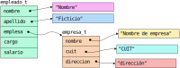

# Estructuras

Típicamente, en todo programa no minúsculo, se trabaja con datos que están relacionados entre sí.
Por ejemplo, con puntos en $\mathbb{R}^n$, con figuras geométricas, con usuarios, con sensores, etc.
Hasta ahora, la solución para manipular datos en $\mathbb{R}^2$ sería tener 2 variables que nos sirvan para identificar
$x$ e $y$ (sean 2 `#!c float` o 2 arreglos), para manipular usuarios tendríamos que tener todos los datos importantes
(un identificador, un nombre, un nombre de usuario, y otros que dependerán de la aplicación).
Por ejemplo, pensemos una aplicación que opera con vectores (que inician en el origen): utilizaremos 3 `#!c float` para
almacenar las coordenadas del vector, e implementaremos funciones que suman, restan, multiplican vectores por
constantes, etc.

``` c linenums="1"
/* consideramos un vector desde (0, 0, ), por lo que sólo necesitamos 3 puntos para representarlo */

/* @brief suma 2 vectores y nos devuelve las componentes de la suma en un tercer vector
 * @param outx componente x de un vector de salida
 * @param outy componente y de un vector de salida
 * @param outz componente z de un vector de salida
 * @param in1x componente x de un vector de entrada
 * @param in1y componente y de un vector de entrada
 * @param in1z componente z de un vector de entrada
 * @param in2x componente x de un vector de entrada
 * @param in2y componente y de un vector de entrada
 * @param in2z componente z de un vector de entrada
*/
status_t vector_suma(double *outx, double *outy, *double outz,
                     double in1x, double in1y, double in1z,
                     double in2x, double in2y, double in2z)
{
    if ((NULL == outx) || (NULL == outy) || (NULL == outz)) {
        return ST_ERR_NULL_PTR;
    }

    *outx = in1x + in2x;
    *outy = in1y + in2y;
    *outz = in1z + in2z;

    return ST_OK
}
```

Ya con la función que suma dos vectores vemos que:

1.  la función tiene demasiados parámetros para lo poco que hace,
2.  cada función que trabaje con vectores deberá tener igual cantidad de parámetros.

Sin embargo, veamos cómo se invoca a esta función, y el código relevante para ello:

``` c linenums="1"
...
float x1, y1, z1;
float x2, y2, z2;
float ox, oy, oz;
status_t st;
...
st = vector_suma(&ox, &oy, &oz, x1, y1, z1, x2, y2, z2);
```

Claramente, no es algo cómo para manipular, y por eso tenemos estructuras.

## ¿Qué son las estructuras?

Las estructuras son la herramienta que nos da el lenguaje de programación C para crear tipos compuestos de datos.
De este modo, podemos agregar variables que estén relacionadas en un nuevo tipo de dato, encapsulando la información.
Esto no sólo nos permite manipular las variables en bloque, sino que nos permite asignarle un nombre al conjunto para
hacer referencia a éste de una forma más sencilla, legible y coherente.

La sintaxis para definir una estructura es:

``` c linenums="1" title="Definición de estructuras"
struct <nombre> {
    <tipo de variable> <nombre de variable>;
    ...
    <tipo de variable> <nombre de variable>;
};
```

Una vez que tenemos la estructura definida, podemos declarar una variable según la sintaxis:

``` c linenums="1" title="Declaración de variables usando estructuras"
struct <nombre> variable;
```

Retomando el ejemplo de los vectores, para definir una estructura con las 3 componentes del vector escribiríamos:

``` c linenums="1" title="Ejemplo: estructura vector"
struct vector3 {
    double x;
    double y;
    double z;
} ;
```

obteniendo así un nuevo tipo llamado `struct vector3`.
Al igual que con cualquier variable, para declarar una variable del tipo `struct vector3` escribimos:

``` c linenums="1" title="Ejemplo: declaración de una variable de tipo `struct vector`"
struct vector3 vec1;
```

donde `vec1` es el nombre de la variable.
Reescribamos el prototipo de la función que suma vectores utilizando este nuevo conocimiento:

``` c linenums="1" title="Ejemplo: función que suma vectores (prototipo)"
status_t vector_suma(struct vector3 *out, struct vector3 v1, struct vector3 v2);
```

En este ejemplo vemos, en la definición del puntero, la misma sintaxis que utilizamos para todos los demás punteros que
hemos visto (por ejemplo, `#!c int *`).
Por lo tanto, podemos crear una variable de tipo `struct vector3` y tener un puntero a dicha variable con `struct
vector3 *`.

### Redefinición del nombre

Siempre que utilizamos estructuras trabajamos con nombres que comienzan con `struct`.
Si bien esto es claro y nos recuerda que el dato que utilizamos es una estructura, lo típico es definir un tipo nuevo a
partir de la estructura utilizando `#!c typedef`.
Tal y como vimos en otros casos, la definición del nuevo tipo lleva la sintaxis:

``` c
typedef <viejo tipo> <nuevo tipo>;
```

por lo que podemos definir la estructura como

``` c
typedef struct vector3 vector3_t;
```

Además, cuando se redefine el nombre como en estos casos, es posible definir la estructura y el nuevo nombre en la misma
sentencia, siguiendo la misma convención que antes:

``` c
typedef struct {
    double x;
    double y;
    double z;
} vector3_t;
```

Esto es similar a haber hecho

``` c
struct vector3 {
    double x;
    double y;
    double z;
};
typedef struct vector3 vector3_t;
```

y el prototipo de la función se vuelve más claro también:

``` c linenums="1" title="Ejemplo: función que suma vectores (prototipo)"
status_t vector_suma(vector3_t *out, vector3_t v1, vector3_t v2);
```

??? tip "Convenciones"

    En este caso, utilicé una convensión típica en la que se define un tipo nuevo con sufijo `_t`.
    Otra convensión utiliza camelCase, definiendo el tipo como `Vector3` en lugar de `vector3_t`, es decir:

    ``` c
    typedef struct Vector3 Vector3;
    ```

    En estos casos, suele utilizarse el camelCase incluso al definir la estructura, con la siguiente notación:

    ``` c
    struct Vector3 {
        double x;
        double y;
        double z;
    };
    ```

    o bien

    ``` c
    typedef struct {
        double x;
        double y;
        double z;
    } Vector3;
    ```

    con lo cual, el prototipo antes visto es

    ``` c linenums="1"
    Status vector_suma(Vector3 *out, Vector3 v1, Vector3 v2);
    ```

## ¿Cuánto espacio, cuánta memoria, ocupa una estructura?

Para comenzar, como tenemos un nuevo tipo, podemos saber en tiempo de compilación cuánto ocupa dicho tipo, la
estructura, utilizando `sizeof`: `#!c sizeof(struct <nombre>)`.
En el caso del ejemplo del vector, tenemos: `#!c sizeof(struct vector3)` o bien `#!c sizeof(vector3_t)`.

Dado que es una composición de elementos, una estructura ocupa **al menos** lo mismo que la suma del almacenamiento de
sus elementos pero, por cuestiones de alineamiento de los datos, puede ocupar más, es decir:

``` c
sizeof(struct vector3) >= 3 * sizeof(double)
```

para el caso del vector.

Ahora, volvamos sobre el prototipo de la función `vector_suma()`:

``` c
status_t vector_suma(struct vector3 *out, struct vector3 v1, struct vector3 v2);
```

Tanto los parámetros `v1` como `v2` se pasan por copia, es decir, toda la información de la estructura debe ser copiada
para pasársela a la función.
Esto es muy ineficiente.
Por eso, las estructuras **siempre** se pasan por puntero, y no únicamente cuando se desea modificarlas.
En este caso, si no se desea modificar la estructura, se pasa a través de un puntero a una estructura constante.
Entonces, el prototipo nos queda:

``` c
status_t vector_suma(struct vector3 *out, const struct vector3 *v1, const struct vector3 *v2);
```

que, por otro lado, es más simple de leer haciendo uso de la definición del tipo `vector3_t`:

``` c
status_t vector_suma(vector3_t *out, const vector3_t *v1, const vector3_t *v2);
```

## Inicialización

Al momento de definir una variable de un tipo que es una estructura se pueden asignar valores a cada uno de sus
componentes.
Para ello hay 2 formas de hacerlo: en orden o por nombres.
En un primer modo, en orden, la estructura se inicializa como si fuese un arreglo, dándole valor a cada uno de los
miembros de la estructura en el orden en que fue definida.
En el caso de la estructura `#!c struct vector3` haríamos:

``` c title="Inicialización estática de una estructura (1)"
struct vector3 vec1 = {0.2, 19.3, 1e-2};
```

mientras que si cargamos los miembros indicandos sus nombres haríamos:

``` c title="Inicialización estática de una estructura (1)"
struct vector3 vec1 = {.x = 0.2, .y = 19.3, .z = 1e-2};
```

Típicamente, incluso con los nombres se inicializan en el orden en que fueron declarados los miembros.
La elección entre un modo u otro es meramente por claridad a la hora de leer el código.

## Acceso

Hemos visto cómo definir estructuras, pero no cómo acceder a sus miembros.
El operador que debemos utilizar es el `.`, un punto.
De este modo, si definimos las variables

``` c
struct vector3 v1;
vector3_t v2;
```

podemos acceder a sus elementos del siguiente modo:

``` c
v1.x = 3.5;     /* escritura del elemento x de v1 */
v1.y = v2.x;    /* lectura del elemento x de v2 y escritura de y en v1 */
v1.z = v2.z;    /* lectura de z en v2 y escritura de z en v1 */
```

Por otro lado, si en lugar de la estructura tenemos un puntero a la misma, se cumplen las mismas reglas que con todos
los punteros: podemos utilizar el operador de indirección (`*`):

``` c
vector3_t v1;
struct vector3 v2;
struct vector3 *pv1;
vector3_t *pv2;

pv1 = &v1;
pv2 = &v2;

(*pv1).x = 3.5;
(*pv1).y = (*v2).x;
(*pv1).z = (*v2).z;
```

Sin embargo, esta escritura se vuelve engorrosa cuando tenemos múltiples estructuras anidadas.
Supongamos una estructura `empleado_t`.
Esta estructura está compuesta por dos cadenas de caracteres dinámicas (`char *`) para el nombre y apellido, un
puntero a una estructura de tipo `empresa_t` que define la empresa en la que trabaja el empleado, un enumerativo para su
cargo y un número para su salario.
A su vez, la estructura `empresa_t` está definida por cadenas de caracteres dinámicas para su razón social, su CUIT y su
dirección.
La figura 1 nos da un esquema de este tipo.

<figure markdown>

<caption>**Fig. 1:** Diagrama de la estructura `empleado_t` con estructuras anidadas.</caption>
</figure>

El código que implementa esta la figura 1 se muestra a continuación:

``` c linenums="1"
typedef struct empresa {
    char *nombre;
    char *cuit;
    char *direccion;
} empresa_t;

typedef struct empleado {
    char *nombre;
    char *apellido;
    empresa_t *empresa;
    cargo_t cargo;
    double salario;
} empleado_t;
```

Luego, podemos definir variables y utilizarlas del siguiente modo (utilizando notación de punteros):

``` c linenums="14"
...
empresa_t ypf = {"YPF S.A.", "30-54668997-9", "Macacha Güemes 515"};
empleado_t empleado = {"Nombre", "Ficticio", &ypf, CARGO_VP_IPD, 945021.2};
empleado_t *puntero = &empleado;
...
puts((*(*puntero).empresa).nombre);
```

Como podemos ver, es una notación sumamente ofuscada.
Por eso se utiliza el operador `->` para acceder a los miembros de una estructura cuando se posee un puntero a la misma.
El mismo ejemplo que antes, pero utilizando el operador `->` se convierte en:

``` c linenums="19"
puts(puntero->empleo->nombre);
```

Vemos que la notación es `<puntero a estructura> -> <miembro>`.
Como aclaración, dependiendo de la fuente que utilice el navegador podríamos ver el operador como una flecha, pero en
realidad es un guión `-` y un `>` juntos.

!!! example "Ejemplo: creación de estructuras"

    ¿Cómo haríamos si quisiéramos crear una estructura del tipo `empresa_t`?
    ¿Y una estructura del tipo `empleado_t`?
    A continuación se dan ejemplos de funciones que cargar/crean estructuras de tipo `empresa_t`

    === "Estática"

        ``` c linenums="1"
        status_t empresa_cargar(empresa_t *empresa, const char *razon_social, const char *cuit, const char *direccion)
        {
            if ((NULL == empresa) || (NULL == razon_social) || (NULL == cuit) || (NULL == direccion)) {
                return ST_ERR_NULL_PTR;
            }

            empresa->nombre = strdup(razon_social);
            if (NULL == empresa->nombre) {
                return ST_ERR_ENOMEM;
            }

            empresa->cuit = strdup(cuit);
            if (NULL == empresa->cuit) {
                free(empresa->nombre);
                return ST_ERR_ENOMEM;
            }**
            empresa->direccion = strdup(direccion);
            if (NULL == empresa->direccion) {
                free(empresa->cuit);
                free(empresa->nombre);
                return ST_ERR_ENOMEM;
            }

            return ST_OK;
        }
        ```

        Notar que esta función **no crea** una estructura, sino que carga los datos en una ya creada.
        Por ejemplo:

        ``` c linenums="1"
        empresa_t ypf;
        status_t st;
        ...
        st = empresa_cargar(&ypf, "YPF S.A.", "30-54668997-9", "Macacha Güemes 515");
        ```

    === "Dinámica"

        ``` c linenums="1" hl_lines="7"
        status_t empresa_crear(empresa_t **empresa, const char *razon_social, const char *cuit, const char *direccion)
        {
            if ((NULL == empresa) || (NULL == razon_social) || (NULL == cuit) || (NULL == direccion)) {
                return ST_ERR_NULL_PTR;
            }

            *empresa = (empresa_t *) calloc(1, sizeof(empresa_t));
            if (NULL == *empresa) {
                return ST_ERR_ENOMEM;
            }

            (*empresa)->nombre = strdup(razon_social);
            if (NULL == (*empresa)->nombre) {
                free(*empresa);
                *empresa = NULL;
                return ST_ERR_ENOMEM;
            }

            (*empresa)->cuit = strdup(cuit);
            if (NULL == (*empresa)->cuit) {
                free((*empresa)->nombre);
                free(*empresa);
                *empresa = NULL;
                return ST_ERR_ENOMEM;
            }
            (*empresa)->direccion = strdup(direccion);
            if (NULL == (*empresa)->direccion) {
                free((*empresa)->cuit);
                free((*empresa)->nombre);
                free(*empresa);
                *empresa = NULL;
                return ST_ERR_ENOMEM;
            }

            return ST_OK;
        }
        ```

    !!! note "Ejercicio"

        La implementación de las funciones análogas para `empleado_t` se dejan al lector.

    Un ejemplo de una función que recibe una estructura, constante, es aquella que la imprime, por ejemplo:

    ``` c linenums="1"
    void empresa_print_csv(const empresa_t *empresa)
    {
        if (NULL != empresa) {
            printf("\"%s\",\"%s\",\"%s\"", empresa->nombre, empresa->cuit, empresa->direccion);
        }
    }

    void empresa_print_pretty(const empresa_t *empresa)
    {
        if (NULL != empresa) {
            printf("Razón Social: %s\n", empresa->nombre);
            printf("CUIT: %s\n", empresa->cuit);
            printf("Dirección: %s\n", empresa->direccion);
        }
    }

    void empleado_print_csv(const empleado_t *empleado)
    {
        if (NULL != empleado) {
            printf("\"%s\",\"%s\",", empleado->nombre, empleado->apellido);
            printf("\"%s\",\"%s\",\"%s\",", empleado->empresa->nombre, empleado->empresa->cuit, empleado->empresa->direccion);
            printf("\"%s\",\"%.4f\",", cargo_to_str(empleado->cargo), empleado->salario);
        }
    }
    ```

## Arreglos de estructuras

Los arreglos de estructuras podemos definirlos de 2 maneras, como todo arreglo: estático o dinámico.
Un arreglo estático se define como cualquier otro arreglo, considerando que el tipo ahora es `#!c struct nombre` o
`nombre_t`:

``` c
vector3_t vectores[100];
```

Esta sentencia crea un arreglo de 100 estructuras de tipo `vector3_t` y ocupa un espacio dado por `#!c
sizeof(vectores)`, que es igual a `#!c 100 * sizeof(vector3_t)`.

Si lo definimos en forma dinámica, tenemos que recordar que necesitamos un puntero a una estructura (o muchas, que es lo
mismo para el puntero) y su cantidad.
En este caso, para crear un arreglo de 100 estructuras agregaremos las sentencias:

``` c
vector3_t *vectores;
...
vectores = (vector3_t *) malloc(100 * sizeof(vector3_t));
if (NULL == vectores) { ... }
```

o bien, lo podemos hacer con `calloc`:

``` c
vector3_t *vectores;
...
vectores = (vector3_t *) calloc(100, sizeof(vector3_t));
if (NULL == vectores) { ... }
```

Luego, podemos acceder a cualquier estructura del arreglo mediante el índice, y accedemos a los miembros de la
estructura utilizando el operador `.` como se muestra a continuación:

``` c
printf("(%.4f, %.4f, %.4f)", vectores[42].x, vectores[42].y, vectores[42].z);
```

## Arreglo de punteros a estructuras

En este caso, lo más común es tener arreglos dinámicos de estructuras también dinámicas.
Para ello, tenemos que definir un puntero doble, es decir, un arreglo (dinámico) de punteros a estructuras.
Esto lo hacemos con la sentencia que define punteros dobles, para `#!c struct nombre` o `nombre_t`.
Sea la estructura `estudiante_t` definida como

``` c linenums="1"
typedef struct estudiante {
    char *nombre;
    char *apellido;
} estudiante_t;
```

podemos definir el arreglo de punteros como

``` c
estudiante_t **estudiantes;
```

Luego, podemos asignarle un bloque de memoria dinámica utilizando `malloc()`:

``` c
estudiantes = (estudiante_t **) malloc(40 * sizeof(estudiante_t *));
```

Finalmente, dada una función que crea un `estudiante` en forma dinámica (que podría seguir el prototipo `#!c
estudiante_t * estudiante_crear(const char *nombre, const char *apellido)`) utilizaríamos:

``` c linenums="1" hl_lines="14 29"
status_t crear_arreglo_interactivamente(estudiante_t ***estudiantes, size_t n)
{
    char nombre[256];
    char apellido[256];

    if (NULL == estudiantes) {
        return ST_ERR_NULL_PTR;
    }

    if (0 == n) {
        return ST_ERR_INVALID_ARG;
    }

    *estudiantes = (estudiante_t **) malloc(n * sizeof(estudiante_t *));
    if (NULL == *estudiantes) {
        return ST_ERR_ENOMEM;
    }

    for (size_t i = 0; i < n; ++i) {
        if (NULL == fgets(nombre, 256, stdin)) {
            destruir_arreglo_estudiantes(estudiantes, i);
            return ST_ERR_IO;
        }
        if (NULL == fgets(apellido, 256, stdin)) {
            destruir_arreglo_estudiantes(estudiantes, i);
            return ST_ERR_IO;
        }

        (*estudiantes)[i] = estudiante_crear(nombre, apellido);
        if (NULL == (*estudiante)[i]) {
            destruir_arreglo_estudiantes(estudiantes, i);
            return ST_ERR_ENOMEM;
        }
    }

    return ST_OK;
}
```

Las líneas resaltadas (14 y 29) son las que crean el arreglo y crean los estudiantes en forma dinámica.

Notar que se validan todos los ingresos de datos.

## Modularización

Generalmente, cuando se trabaja con estructuras, estamos implementando funciones que manipulan las estructuras, que las
crean, o las destruyen, tanto para hacer legible el código como para evitar repetirlo y darle coherencia.
Imaginen el código escrito en la sección anterior donde, en lugar de utilizar las funciones
`destruir_arreglo_estudiantes` y `estudiante_crear` en la función `crear_arreglo_interactivamente`, se agrega el código
de las primeras directamente en el cuerpo de la última (¡3 veces repetiríamos el código de
`destruir_arreglo_estudiantes`!).

Por ello, una modularización clásica suele contener al menos un archivo `.h` y un archivo `.c`.
En el encabezado se define la estructura y los prototipos, mientras que en el archivo de implementación se
implementan---valga la redundancia---las función definidas en el encabezado.

!!! example "Modularización: estudiantes"

    === "Encabezado"

        ``` c linenums="1" title="estudiante.h"
        --8<-- "estructuras/estudiante.h"
        ```

    === "Implementación"

        ``` c linenums="1" title="estudiante.c"
        --8<-- "estructuras/estudiante.c"
        ```

## Biblioteca estándar para manejo de estructuras

Dado que las estructuras son intrínsecamente un tipo de dato creado por el desarrollador, no hay bibliotecas para
manejar estructuras arbitrarias.

## Guías de ejercicios

La guía de ejercicios de estructuras se encuentra [aquí](../../guias/c/estructuras/).
